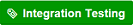
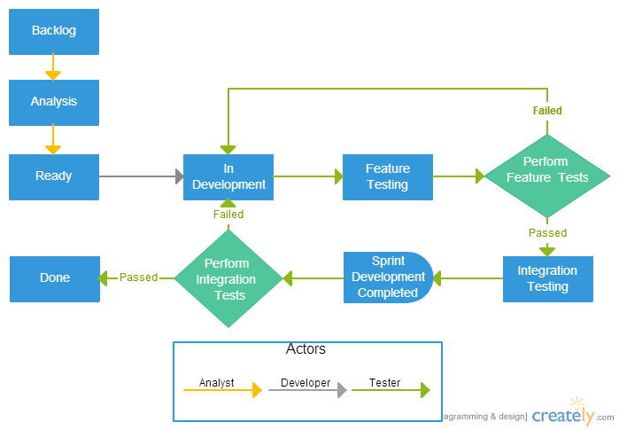
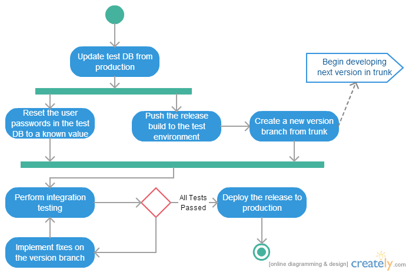

This document defines the guidelines we follow for task management using GitHub Issues.  It is intentionally lean and covers primarily how individual releases are managed.

# Task Management
Issues flow through the following states during their lifecycle:

1. **Backlog** - issues have been identified but are not yet ready for development.

2.  - issues are actively being analyzed, typically by a tech lead to ensure the work is Ready for development.

2.  - issues have been fleshed out to the point where they are believed to be ready to be acted upon by developers working on the associated milestone.

3.  - issues are actively being worked on by a developer.  With the exception of items that are blocked or returned to development due to failed tests, each developer should strive to have as few items in this state as possible.

4.  - issues are code complete and can be acted on by testers.  All code is assumed to be checked in and deployed to the appropriate environments for testing.

5.  - issues have been unit tested and are ready for closure pending end of sprint integration testing.

6. **Done** - issues have passed testing and are closed.

All states are controlled via GitHub labels mapped to the appropriate state. By default, state transitions are managed simply by removing the current state label and applying the appropriate next state label.  Waffle.io may be used to do this automatically via drag-drop. The following label mappings are in use:

* Backlog -> No State Label, issue is Open
* Analysis -> Analysis label
* Ready -> Ready label
* In Development -> In Development label
* Feature Testing -> Feature Testing label
* Integration Testing -> Integration Testing label
* Done -> Issue is Closed (regardless of labels)

### Integration Testing
Items in the integration testing state have passed all unit tests in the development environment and are considered complete pending final end of phase integration testing.  Once all development work for the sprint has been completed, items will be integration tested before being moved to Done.

### Failed Tests
When a test fails, in addition to moving the item back to **In Development**, the tester should apply the **Test Failed** label and re-assign the issue to the original developer.  This will aid in tracking priorities and help developers identify what needs their immediate attention.

# Release Closure
Each release has several tasks that need to be carried out to finalize the release.  These tasks are designed to facilitate testing and publication of the completed release, as well as to prepare for the next release.

The first step is to update the test and development databases with the latest data from production.  Following that, we publish the completed release to the test environment and perform integration testing.  Once all of the release items have passed integration testing, we deploy the release and update any pending operational items to indicate which ones can now be worked on.  The following graphic shows the individual steps for this process.

# To Use This Process

The only thing that you need to configure to use this process is to add the below labels to your repo.

### Option 1: Manually add the labels

The following can be used for configuring the label names and colors:

 `#fbca04`

 `#fbca04`

 `#fbca04`

 `#009800`

 `#009800`

 `#b60205`

 `#b60205`

 `#d93f0b`

 `#000000`

### Option 2: Script to add the labels

This [bash script](/set-github-labels.sh) can be used to:
* Remove the default GitHub labels automatically add when a repo is created.
* Add the above process labels.

The script requests a GitHub Personal Access Token which in order to access private repos. You will need to first create a token by following [these instructions](https://help.github.com/articles/creating-an-access-token-for-command-line-use/).

To run the script:
* Download (or git clone the repo).
* Set execute permissions; `chmod +x /path/set-github-labels.sh`.
* Drag the file into Terminal.
