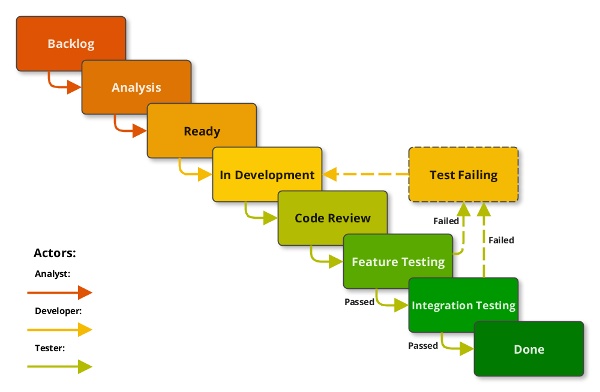
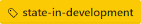
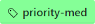
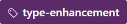

# GitHub Task Management

This document defines the guidelines we follow for task management using GitHub Issues.  It is intentionally lean and covers primarily how individual releases are managed.

## Introduction
Issues typically flow through the below states during their lifecycle.

Most states are controlled via GitHub labels. By default, state transitions are
managed simply by removing the current state label and applying the appropriate
next state label. The exception are the _Backlog_ and _Done_ states. State labels do not control these
states. Rather they are controlled by being Open or Closed, and whether they are
assigned to a milestone. That rule applies regardless of any labels assigned to it.

## States

Any issue with a  label is automatically excluded from the below states.

State | Label&nbsp;&nbsp;&nbsp;&nbsp;&nbsp;&nbsp;&nbsp;&nbsp;&nbsp;&nbsp;&nbsp;&nbsp;&nbsp; | In a Milestone? | Issue State | Progress | Description
---|---|:-:|---|--:|---
**Backlog** | n/a | ✗ |  | 0% | Issues have been identified but are not yet ready for development.
**Analysis** | _state-analysis_ | ✓ |  | 10% | Issues are actively being analyzed, typically by a Business Analyst or Lead Developer, to ensure the work is Ready for development.
**Ready** | _state-ready_ | ✓ |   | 20% | Issues have been fleshed out to the point where they are believed to be ready to be acted upon by developers working on the associated milestone.
**Test Failing** | _state-test-failing_ | ✓ |  | 30% | The tester failed the implementation. It is assumed that failed items went through code review, so they inherit the percent complete from Code Review.
**In Development** | _state-in-development_ | ✓ |  | 30% | Issues are actively being worked on by a developer.  With the exception of items that are blocked or returned to development due to failed tests, each developer should strive to have as few items in this state as possible.
**Code Review** | _state-code-review_ | ✓ |  | 70% | The developer believes he/she is complete and has submitted the issue for peer review.
**Feature Testing** | _state-feature-testing_ | ✓ |  | 80% | Issues are code complete and can be acted on by testers.  All code is assumed to be checked in and deployed to the appropriate environments for testing.
**Integration Testing** | _state-integration-testing_ | ✓ |  | 90% | Issues have been unit tested and are ready for closure pending end of sprint integration testing.
**Done** | n/a | n/a |  | 100% | Issues have passed testing and are closed.

### Testing

#### Integration Testing
Items in the integration testing state have passed all unit tests in the development environment and are considered complete pending final end of phase integration testing. Once all development work for the sprint has been completed, items will be integration tested before being moved to _Done_.

#### Failed Tests
When a test fails, in addition to moving the item back to _In Development_, the tester should apply the _Test Failing_ label and re-assign the issue to the original developer.  This will aid in tracking priorities and help developers identify what needs their immediate attention.

## Schematic

## Labels

The only thing that you need to configure to use this process is to add the below labels to your repo.

### Import labels

This [bash script](/set-github-labels.sh) can be used to:
* Remove the default GitHub labels automatically adds when a repo is created.
* Add the above process labels.

The script requests a GitHub Personal Access Token which in order to access private repos. You will need to first create a token by following [these instructions](https://help.github.com/articles/creating-an-access-token-for-command-line-use/).

**To run the script:**  
1. Download (or `git clone` the repo)
1. Set execute permissions: `chmod +x /path/set-github-labels.sh`
1. Drag the file into Terminal

### Manually add the labels

The following can be used for configuring the label names and colors:

#### State labels

&nbsp;&nbsp;&nbsp;&nbsp;&nbsp;&nbsp;&nbsp;&nbsp;&nbsp;&nbsp;&nbsp;&nbsp;&nbsp;&nbsp;&nbsp;&nbsp;&nbsp;&nbsp;&nbsp;&nbsp;&nbsp;&nbsp;&nbsp;&nbsp;&nbsp;&nbsp;&nbsp;&nbsp;&nbsp;&nbsp;&nbsp;&nbsp;&nbsp;&nbsp;&nbsp;&nbsp;
| Label | Color | Description
---|---|---|:-:
 | _state-analysis_ | `#dd7404` | See state description above
 | _state-ready_ | `#ec9f04` | "
 | _state-test-failing_ | `#f5ba04` | "
 | _state-in-development_ | `#fbca04` | "
 | _state-code-review_ | `#b3bb02` | "
 | _state-feature-testing_ | `#59a901` | "
 | _state-integration-testing_ | `#009800` | "

#### Priority labels

&nbsp;&nbsp;&nbsp;&nbsp;&nbsp;&nbsp;&nbsp;&nbsp;&nbsp;&nbsp;&nbsp;&nbsp;&nbsp;&nbsp;&nbsp;&nbsp;&nbsp;&nbsp;&nbsp;&nbsp;&nbsp;&nbsp;&nbsp;
| Label | Color | Description
---|---|---|---
 | _priority-high_ | `#0aff2f` | High priority
 | _priority-med_ | `#85ff97` | Normal priority
 | _priority-low_ | `#adffba` | Low priority

#### Type labels (optional)

&nbsp;&nbsp;&nbsp;&nbsp;&nbsp;&nbsp;&nbsp;&nbsp;&nbsp;&nbsp;&nbsp;&nbsp;&nbsp;&nbsp;&nbsp;&nbsp;&nbsp;&nbsp;&nbsp;&nbsp;&nbsp;&nbsp;&nbsp;&nbsp;&nbsp;&nbsp;&nbsp;&nbsp;&nbsp;&nbsp;&nbsp;
| Label | Color | Description
---|---|---|---
 | _type-bug_ | `#b60205` | Bug / Error
 | _type-enhancement_ | `#5b2a68` | Enhancement / Feature request
 | _type-documentation_ | `#2740a1` | Project documentation (`README.md`/Wiki/Javadoc/...)

#### Flag labels

&nbsp;&nbsp;&nbsp;&nbsp;&nbsp;&nbsp;&nbsp;&nbsp;&nbsp;&nbsp;&nbsp;&nbsp;&nbsp;&nbsp;&nbsp;&nbsp;&nbsp;&nbsp;&nbsp;&nbsp;&nbsp;&nbsp;&nbsp;&nbsp;&nbsp;&nbsp;&nbsp;&nbsp;&nbsp;&nbsp;
| Label | Color | Description
---|---|---|---
 | _flag-trash_ | `#006b75` | An issue that is deleted but not _Done_ (since you cannot delete an issue in GitHub Issues)
 | _flag-invalid_ | `#006b75` | Issue that has doesn't conform to the contribution guidelines (`ISSUE_TEMPLATE.md`) or spam
 | _flag-duplicate_ | `#006b75` | Issue that already exists
 | _flag-wontfix_ | `#006b75` | Issue that won't be implemented
 | _flag-requirement_ | `#006b75` | Formal requirement
 | _flag-help-wanted_ | `#006b75` | "Can someone help me?"
 | _flag-device-specific_ | `#006b75` | Issue that only occurs on some devices

## Scheduling the project

Follow this scheme to schedule releases in GitHub:

1. Create a Milestone for every two weeks
    * Name the project in the format _"Release [#.##]"_, e.g. _"Release 0.01"_
    * Select the Due Date
    * Add a brief description of the milestone
1. Assign issues to each milestone
1. Create an overall project schedule using [milepost](https://github.com/80-20/milepost).
1. When satisfied with the schedule, email to the team and evenutally the client.
